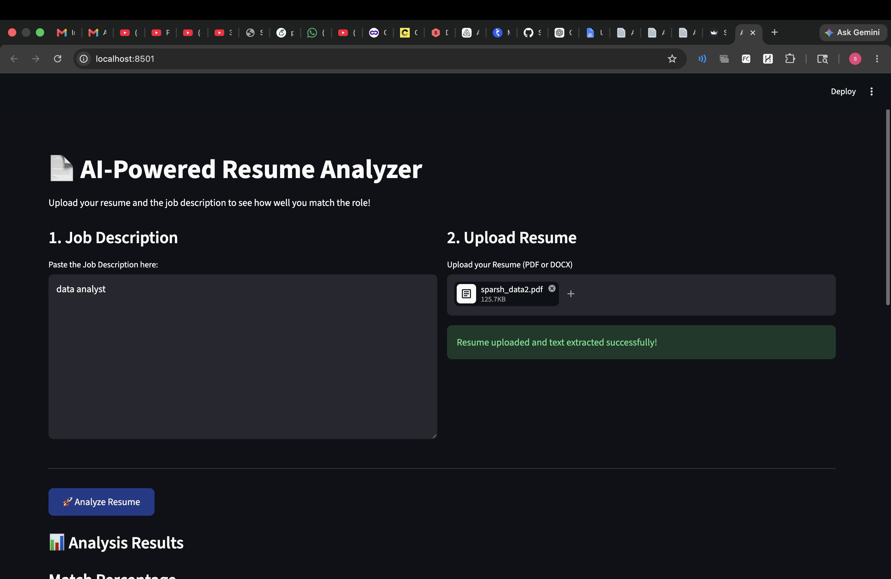
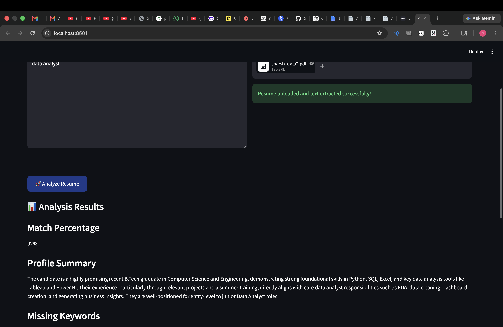
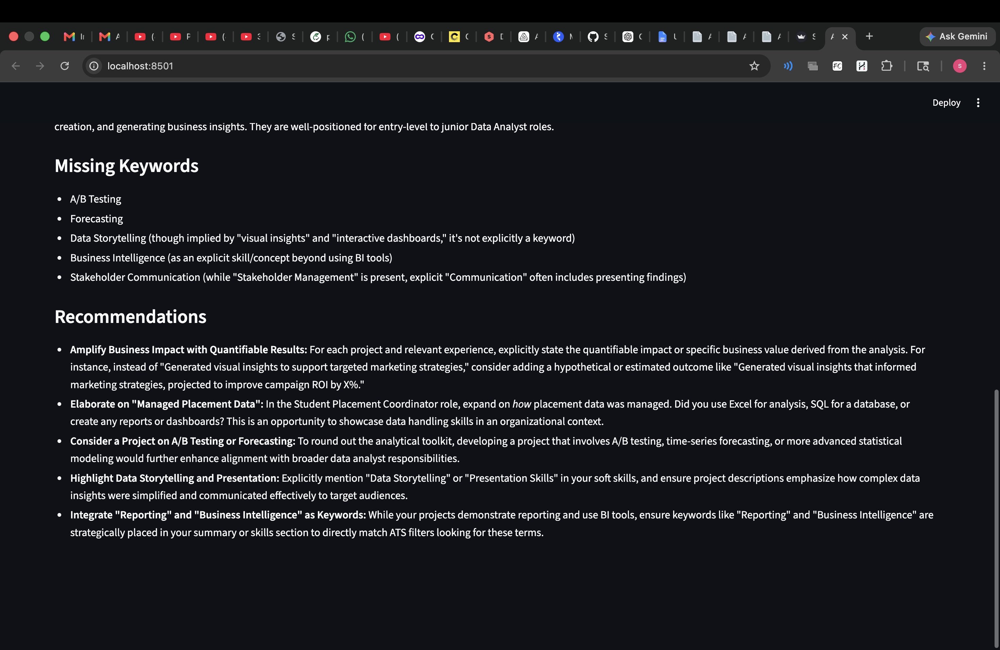

# 🤖 AI Resume Analyzer

An AI-powered Resume Analyzer built using **Python, Streamlit, and Google Gemini AI**.  
It extracts resume content (PDF/DOCX) and provides intelligent AI-based feedback, skill analysis, and improvement suggestions.

---

## 🚀 Features

- 📄 Upload Resume (PDF / DOCX)
- 🧠 AI-powered analysis using Google Gemini AI
- 📊 Skill extraction and evaluation
- 💡 Resume improvement suggestions
- 🌐 Simple and interactive Streamlit web app

---

## 🛠️ Tech Stack

- Python
- Streamlit
- Google Gemini AI (Generative AI)
- PyPDF2 (PDF parsing)
- python-docx (DOCX parsing)
- python-dotenv (environment variables)

## 📸 Screenshots

### Home Page

### Upload Resume

### Result

